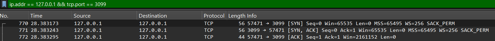

# Custom TCP Chat App (Node.js)

### Motivation & Learning Goals

I built this project to master the low-level internals of backend engineering that are often abstracted away by high-level frameworks. On top of that I love to understand low level and hardware stuff and how things work `under the hood`. My goal was to move beyond simple APIs and deeply understand:

- **Buffer Management:** Handling raw binary data and understanding memory allocation.
- **Stream API:** Mastering duplex streams and data flow control.
- **Networking Fundamentals:** Working directly with TCP sockets and stream-based communication on top of the OS TCP/IP stack, managing socket lifecycles ect.
- **Protocol Design:** Engineering a custom communication contract from scratch.

### Project Description

This project is a low-level implementation of a real-time chat server built directly on top of the TCP/IP stack using Node.js `net` module. Unlike standard Web-Socket or HTTP-based applications, this engine manages raw duplex streams, custom message framing, in-memory state management, and custom json based protocol. As for the interface, a simple good old CLI will suffice.

### Protocol

TCP communication is nothing more than a duplex network stream over which 2 distant machines exchange binary data.

When we use `net.createServer` we create an instance of the server that listens on the specific PORT and IP address for the connections. Each time a client connects, the server instantiates a socket object.

Client on the other hand is the one who initiates the communication with `net.createConnection` and creating the socket object.

Client and server establish communication via `TCP 3 way handshake`:

1. SYN (Synchronize) - client sends connection request and instantiates socket object on its part.
2. SYN-ACK (Synchronize-Acknowledgment) - Server accepts the request and instantiates proportional socket.
3. ACK (Acknowledgment) - Client receives the server's sequence number `Y`, returns `Y+1`, and the connection is established.

Here is the example of 3 way hand shake that I caught using wireshark and localy run server & client scripts.
Both are running on loopback ip address 127.0.0.1
Client is running on the port 57471.
Server is running on the port 3099.


Now we have the connection and a way to transmit data, albeit binary data. Before sending data over the network we have to decide on encoding standard for the web and data transmission over network.

### Encoding and Decoding

> "Encoding is the process of converting data, signals, or information into a specific, structured format (e.g., transforming text into binary or analog to digital) for secure, efficient storage or transmission. Decoding is the inverse process, converting that encoded format back into its original, interpretable form."
> — **Google Gemini AI**

- **Encoding (Serialization):** Before sending, the client converts the `Message` object into a JSON string and then encodes it into a chosen encoding standard, for exanple, **UTF-8 byte stream**. UTF-8 is chosen for its efficiency with ASCII characters (1 byte per char), which form the bulk of our protocol keys.
- **Decoding (Deserialization):** Upon receiving binary chunks, the server decodes the UTF-8 bytes back into a string. Once the full message is captured (using our line-delimited framing), it is parsed back into a **JavaScript object** for the logic handler to process.

##### line-delimiter

- Because TCP is a network stream, it doesn't know where our JSON objects start or end. By using a certain arbitrary rule we can create that boundary. This allows server to buffer incoming data and only parse it once a full message arrives. Otherwise server would try to parse incomplete messages. A good example of this is the HTTP protocol, which uses `\r\n\r\n `(double CRLF) as a delimiter to mark the end of the headers and the beginning of the body.

This transformation ensures that complex data structures can survive the trip across the network and remain consistent on both ends.

## Custom JSON based protocol

Here is our custom JSON based protocol, you can find it in models/protocol.ts

```typescript
type MessageType = "AUTH" | "CHAT" | "ERROR" | "SYSTEM";

interface Message {
  type: MessageType;
  payload: string;
  timestamp: number;
  sender: UserName;
  to?: UserName[];
}

export interface AuthMessage extends Message {
  type: "AUTH";
}

export interface ChatMessage extends Message {
  type: "CHAT";
  chatRoom: number;
}

export interface SystemMessage extends Message {
  type: "SYSTEM";
}

export interface ErrorMessage extends Message {
  type: "ERROR";
  code: number;
}
```

Our line-deliminator will be `\n`

## Application specification

Now that we have network part ready, we have to discuss application logic. We need to describe our application in details before we begin the coding.

1. Upon successful TCP handshake, every new connection is immediately placed into default room called `LOBBY`.
2. **Authentication** is next obvious step:

- **2.1 Pre-Authentication** - The user can see "System" message, but cannot participate in the chat. System message is explaning and demanding of him to register.

- **2.2 Post-Authentication** - Once validated, the user is officially joined to the LOBBY. But he still only sees "System" message, telling him to choose from the list of exisisting chat rooms or to create his own.

3. **Application entities** - there are 2 entities chat room and user that are in n:n relationship:

- **3.1 Chat rooms** are different realms in the application. User can freely move across different rooms(provided they meet specific criteria), exchange ChatMessages, or create his own chatrooms.
  - **3.1.1** - Choosing the chat room is done by command `@SYSTEM join-room[name]`, the server then either gets that user in or requests a key if the room is locked. If all requirements are meet, user officially joins the room and system announces it.
  - **3.1.2** - Creating the room is done with command `@SYSTEM create-room[name]`, user will automatically become room admin giving him access to all sorts of other commands, more on that later...

- **3.2 User** is inhabitant of the afformentioned chat rooms. One user can be a member of multiple rooms. He can switch rooms in his current window using command `@SYSTEM join-room[name]` or by opening new CLI tab and logging with correct credentials.

### COMMANDS

Commands are instructed from CLI as a **ChatMessage** starting with `@SYSTEM` followed by an action such as `join-room[name]`. For example: `@SYSTEM join-room[KacRoom]`.

| Command                     | Description                                                                                      | Example                         |
| :-------------------------- | :----------------------------------------------------------------------------------------------- | :------------------------------ |
| `@SYSTEM join-room[name]`   | Requests to join an existing chat room. If the room is locked, the server will prompt for a key. | `@SYSTEM join-room[Lobby]`      |
| `@SYSTEM create-room[name]` | Creates a new chat room and automatically assigns the sender as the **Admin**.                   | `@SYSTEM create-room[DevSpace]` |
